# Self-Healing DevSecOps Platform
## Self-Healing Infrastructure & Security Governance on AWS ECS

---

## Executive Summary

This proposal outlines an **Autonomous Self-Healing Infrastructure Platform** that uses AI agents to detect, diagnose, and remediate infrastructure failures in real-time. The system combines chaos engineering, observability, and LLM-powered reasoning to achieve zero-touch operations with full audit compliance.

---

## 1. Problem Statement

In high-compliance Fintech environments, manual incident response creates critical bottlenecks:

| Challenge | Impact |
|-----------|--------|
| **Operational Fatigue** | SRE teams spend ~70% of time on repetitive firefighting and log analysis |
| **Configuration Drift** | Manual hotfixes bypass version control, violating SOC2/audit standards |
| **Security Latency** | Misconfigurations remain exposed for minutes/hours awaiting human triage |

---

## 2. Proposed Solution: The "Autonomous Lab"

Deploy a **Self-Operating Laboratory** where infrastructure manages itself through an AI-driven feedback loop:

```mermaid
flowchart LR
    A[🔥 Chaos Injection] --> B[📊 Detection]
    B --> C[🧠 AI Reasoning]
    C --> D[🔧 Remediation]
    D --> E[✅ Verification]
    E -.->|Continuous Loop| A
```



**Core Components:**
- **Target Application**: OpenTelemetry Astronomy Shop (multi-language microservices)
- **Chaos Source**: AWS Fault Injection Service (FIS)
- **AI Agent**: LangGraph-based multi-agent system on ECS Fargate
- **Remediation Channel**: GitHub PRs for full audit trail

---

## 3. Architecture & Flow

### Detailed System Flow


### Agent State Machine


---

## 4. Feasibility Analysis

### ✅ Strengths

| Aspect | Assessment |
|--------|------------|
| **Technical Viability** | All components (ECS, LangGraph, Prometheus) are production-ready |
| **Compliance Alignment** | GitOps approach satisfies SOC2 audit requirements |
| **Cost Efficiency** | Vendor-neutral observability stack reduces licensing costs |
| **Portfolio Value** | Demonstrates cutting-edge AI + DevOps integration |

### ⚠️ Risks & Mitigations

| Risk | Severity | Mitigation Strategy |
|------|----------|---------------------|
| **LLM Hallucination** | High | Implement confidence thresholds; require human approval for destructive actions |
| **Runaway Remediation** | High | Circuit breakers, max retry limits, and rollback triggers |
| **AWS Cost Overrun** | Medium | Use spot instances for non-critical workloads; set billing alerts |
| **Complexity Creep** | Medium | Phased implementation; MVP first approach |
| **Security of AI Agent** | High | Least-privilege IAM; secrets in AWS Secrets Manager |

### 🎯 Recommended Phased Approach

**Phase 1: Foundation (Weeks 1-2)**
- [ ] Terraform infrastructure (VPC, ECS, IAM)
- [ ] Deploy Astronomy Shop baseline
- [ ] Set up Prometheus + Loki + Grafana

**Phase 2: Detection (Weeks 3-4)**
- [ ] Configure alerting rules
- [ ] Build FastAPI webhook receiver
- [ ] Implement basic AWS FIS experiments

**Phase 3: AI Agent (Weeks 5-7)**
- [ ] LangGraph agent skeleton
- [ ] Loki log querying tool
- [ ] GitHub API integration
- [ ] ECS control plane actions

**Phase 4: Closed-Loop (Weeks 8-9)**
- [ ] End-to-end remediation testing
- [ ] Dashboard as Code implementation
- [ ] Documentation & demo recording

---

## 5. Technology Stack

| Category | Production (AWS) | Local Dev | Rationale |
|----------|-----------------|-----------|----------|
| **Compute** | ECS Fargate | Docker Compose | Serverless, secure, AWS-native |
| **Target App** | OTel Astronomy Shop | Same (containerized) | Pre-instrumented microservices |
| **AI Orchestration** | LangGraph | Same | Cyclic reasoning, state management |
| **Tool Interface** | MCP Server | Same | Standardized AI tool protocol |
| **Chaos Engineering** | AWS FIS | Chaos Toolkit | Portable YAML tests, triggers FIS in prod |
| **Metrics** | Prometheus | Prometheus (Docker) | Identical PromQL queries |
| **Logs** | Grafana Loki | Loki (Docker) | Same LogQL, S3 backend in prod |
| **Dashboards** | Grafana | Grafana (Docker) | DaC support, same JSON exports |
| **Load Balancer** | ALB | — (not needed locally) | Single ALB with path routing in prod |
| **Secrets** | SSM Parameter Store | Docker secrets / .env | Free tier, swap at deploy |
| **Container Registry** | ECR | Local images | Lifecycle policies in prod |
| **IaC** | Terraform | Same | Multi-cloud, mature |
| **CI/CD** | GitHub Actions | Same | Native integration |
| **LLM Provider** | AWS Bedrock / OpenAI | Same API | Claude/GPT-4 for reasoning |

> [!TIP]
> **Additional Recommendations:**
> - **Redis/DynamoDB** for agent state persistence
> - **Slack/PagerDuty** integration for escalation
> - **AWS X-Ray** for distributed tracing correlation

---

## 6. Repository Structure (Refined)

```
self-healing-devsecops-platform/
├── .github/
│   └── workflows/
│       ├── terraform-apply.yml      # Infrastructure deployment
│       ├── docker-build.yml         # Agent container build
│       ├── fis-experiment.yml       # Chaos experiment triggers
│       └── dashboard-sync.yml       # Grafana DaC sync
│
├── terraform/
│   ├── modules/
│   │   ├── networking/              # VPC, subnets, security groups
│   │   ├── ecs-cluster/             # ECS cluster, task definitions
│   │   ├── iam/                     # Roles and policies
│   │   └── observability/           # Prometheus, Loki, Grafana
│   ├── environments/
│   │   ├── dev/
│   │   └── prod/
│   └── backend.tf
│
├── astronomy-shop/
│   ├── kubernetes/                  # Original K8s manifests (reference)
│   └── ecs-taskdefs/                # Converted ECS task definitions
│
├── dashboards/
│   ├── grafana/
│   │   ├── infra-overview.json
│   │   └── agent-activity.json
│   └── prometheus/
│       └── alerting-rules.yml
│
├── agent/
│   ├── src/
│   │   ├── main.py                  # FastAPI webhook receiver
│   │   ├── graph/
│   │   │   ├── nodes.py             # Agent node definitions
│   │   │   ├── edges.py             # State transitions
│   │   │   └── state.py             # State schema
│   │   ├── tools/
│   │   │   ├── loki_client.py       # Log querying
│   │   │   ├── github_client.py     # PR/commit operations
│   │   │   └── ecs_client.py        # Service control
│   │   └── mcp/
│   │       └── server.py            # MCP protocol handler
│   ├── tests/
│   ├── Dockerfile
│   └── requirements.txt
│
├── chaos/
│   ├── experiments/
│   │   ├── container-crash.yaml
│   │   ├── network-latency.yaml
│   │   └── cpu-stress.yaml
│   └── validation/
│       └── recovery-checks.py
│
├── docs/
│   ├── architecture.md
│   ├── runbooks/
│   └── adr/                         # Architecture Decision Records
│
└── README.md
```

---

## 7. Success Metrics

| Metric | Target | Measurement Method |
|--------|--------|-------------------|
| **MTTR Reduction** | 90% vs manual baseline | Timestamped incident logs |
| **Compliance Score** | 100% changes via PR | GitHub audit log analysis |
| **Security Response** | <60s detection-to-patch | FIS experiment timestamps |
| **Agent Accuracy** | >95% correct diagnosis | Manual review sampling |
| **Cost Efficiency** | <$200/month AWS spend | AWS Cost Explorer |

---

## 8. Cost Optimization Strategy 💰

> [!IMPORTANT]
> **Personal Account Constraint**: This project is designed for a personal AWS account with a strict budget target of **$0/month during development** (local-first), **<$50/month** for AWS integration testing, and **<$100/month** for demos.

### 🏠 Local-First Development Strategy

**Develop everything locally with Docker Compose first, deploy to AWS ECS when validated.**


#### Docker Compose Setup (Local Development)

```yaml
# docker-compose.local.yml
version: '3.8'

services:
  # ============ OBSERVABILITY STACK ============
  prometheus:
    image: prom/prometheus:latest
    ports:
      - "9090:9090"
    volumes:
      - ./dashboards/prometheus:/etc/prometheus
    command:
      - '--config.file=/etc/prometheus/prometheus.yml'

  loki:
    image: grafana/loki:latest
    ports:
      - "3100:3100"
    volumes:
      - ./config/loki:/etc/loki

  grafana:
    image: grafana/grafana:latest
    ports:
      - "3000:3000"
    environment:
      - GF_SECURITY_ADMIN_PASSWORD=admin
    volumes:
      - ./dashboards/grafana:/etc/grafana/provisioning/dashboards

  # ============ ASTRONOMY SHOP (SIMPLIFIED) ============
  frontend:
    image: ghcr.io/open-telemetry/demo:latest-frontend
    ports:
      - "8080:8080"
    depends_on:
      - productcatalog
      - cart

  productcatalog:
    image: ghcr.io/open-telemetry/demo:latest-productcatalogservice
    
  cart:
    image: ghcr.io/open-telemetry/demo:latest-cartservice

  # ============ AI AGENT ============
  agent:
    build: ./agent
    ports:
      - "8000:8000"
    environment:
      - PROMETHEUS_URL=http://prometheus:9090
      - LOKI_URL=http://loki:3100
      - GITHUB_TOKEN=${GITHUB_TOKEN}
      - LLM_API_KEY=${LLM_API_KEY}
    depends_on:
      - prometheus
      - loki

  # ============ CHAOS INJECTION ============
  pumba:
    image: gaiaadm/pumba
    volumes:
      - /var/run/docker.sock:/var/run/docker.sock
    # Used manually: docker-compose exec pumba pumba kill frontend
```

#### Local Chaos Testing (No AWS FIS Needed)

```yaml
# chaos/local/container-kill.yml (Chaos Toolkit format)
title: "Kill Frontend Container"
description: "Simulates container crash locally"

method:
  - type: action
    name: "kill-frontend"
    provider:
      type: process
      path: docker
      arguments: ["kill", "frontend"]

  - type: probe
    name: "verify-agent-detection"
    provider:
      type: http
      url: "http://localhost:8000/health"
    tolerance:
      status: 200
```

```bash
# Run local chaos experiment
chaos run chaos/local/container-kill.yml
```

#### What You Can Fully Test Locally

| Component | Local Testability | Notes |
|-----------|------------------|-------|
| ✅ AI Agent Logic | 100% | Full LangGraph execution |
| ✅ Loki Log Queries | 100% | Same LogQL as production |
| ✅ Prometheus Alerts | 100% | Same PromQL rules |
| ✅ Grafana Dashboards | 100% | Export JSON, import to AWS |
| ✅ Container Restart Logic | 100% | Docker API is similar |
| ✅ GitHub PR Creation | 100% | Same API everywhere |
| ⚠️ ECS-specific APIs | Mock | Use LocalStack or mocks |
| ⚠️ AWS FIS | Alternative | Use Chaos Toolkit/Pumba |
| ❌ IAM/VPC/Networking | AWS only | Test with Terraform plan |

#### LocalStack for AWS API Mocking (Optional)

```yaml
# docker-compose.local.yml (add this service)
localstack:
  image: localstack/localstack
  ports:
    - "4566:4566"
  environment:
    - SERVICES=ecs,secretsmanager,ssm
    - DEBUG=1
  volumes:
    - /var/run/docker.sock:/var/run/docker.sock
```

```python
# agent/src/tools/ecs_client.py
import os
import boto3

def get_ecs_client():
    if os.getenv("LOCAL_DEV"):
        return boto3.client(
            'ecs',
            endpoint_url='http://localhost:4566',
            region_name='us-east-1'
        )
    return boto3.client('ecs')
```

#### Revised Development Timeline

| Phase | Duration | Environment | AWS Cost |
|-------|----------|-------------|----------|
| **1. Local Setup** | Week 1 | Docker Compose | $0 |
| **2. Agent Development** | Weeks 2-4 | Docker Compose | $0 (only LLM API ~$10) |
| **3. Full Local Integration** | Weeks 5-6 | Docker Compose | $0 |
| **4. AWS Deployment** | Week 7 | Terraform → ECS | ~$50 |
| **5. Demo Recording** | Week 8 | AWS (full stack) | ~$80 |

**Total Estimated AWS Cost**: ~$130 (vs ~$400+ if developing on AWS from day 1)

> [!TIP]
> **Pro Tip**: Keep AWS deployment as the final 2 weeks. Record your demo video, then immediately `terraform destroy` to stop the billing clock.

---

### Estimated Monthly Costs (AWS Phase Only)

| Service | Configuration | Est. Cost | Optimization Applied |
|---------|--------------|-----------|---------------------|
| **ECS Fargate** | 0.5 vCPU, 1GB RAM × 3 tasks | ~$25/mo | Scheduled shutdown overnight |
| **NAT Gateway** | Single AZ | ~$32/mo | **Avoid** - use VPC endpoints |
| **ALB** | 1 load balancer | ~$16/mo | Use single ALB with path routing |
| **ECR** | ~2GB images | ~$0.20/mo | Lifecycle policies |
| **S3** | Terraform state + logs | ~$1/mo | Intelligent tiering |
| **CloudWatch** | Logs + metrics | ~$5/mo | Aggressive log retention (3 days) |
| **Secrets Manager** | 3-5 secrets | ~$2/mo | Use SSM Parameter Store (free tier) |
| **LLM API Calls** | ~1000 calls/mo | ~$10-20/mo | Use cheaper models for triage |

**Projected Total**: ~$50-80/month (with optimizations)

### Cost-Saving Architecture Decisions


### Specific Optimization Strategies

#### 1. Eliminate NAT Gateway Costs
```hcl
# terraform/modules/networking/vpc_endpoints.tf
# Use VPC Endpoints instead of NAT Gateway

resource "aws_vpc_endpoint" "ecr_api" {
  vpc_id            = aws_vpc.main.id
  service_name      = "com.amazonaws.${var.region}.ecr.api"
  vpc_endpoint_type = "Interface"
}

resource "aws_vpc_endpoint" "s3" {
  vpc_id       = aws_vpc.main.id
  service_name = "com.amazonaws.${var.region}.s3"
  # Gateway endpoint - FREE
}
```

#### 2. Scheduled Infrastructure (Dev Hours Only)
```yaml
# .github/workflows/scheduled-infra.yml
name: Cost-Saving Scheduler

on:
  schedule:
    # Start at 9 AM AEDT (10 PM UTC previous day)
    - cron: '0 22 * * 0-4'  # Sun-Thu nights (Mon-Fri mornings)
    # Stop at 6 PM AEDT (7 AM UTC)
    - cron: '0 7 * * 1-5'   # Mon-Fri mornings (evenings AEDT)

jobs:
  toggle-infra:
    runs-on: ubuntu-latest
    steps:
      - name: Scale ECS to zero (evening)
        if: github.event.schedule == '0 7 * * 1-5'
        run: |
          aws ecs update-service --cluster main \
            --service astronomy-shop --desired-count 0
          aws ecs update-service --cluster main \
            --service ai-agent --desired-count 0
```

#### 3. Right-Sized Task Definitions
```json
// Minimal viable Fargate configuration
{
  "cpu": "256",      // 0.25 vCPU (smallest)
  "memory": "512",   // 0.5 GB (smallest)
  "runtimePlatform": {
    "cpuArchitecture": "ARM64"  // 20% cheaper than x86
  }
}
```

#### 4. Observability Cost Controls

| Component | Expensive Default | Budget Alternative |
|-----------|------------------|-------------------|
| **Prometheus** | Managed (AMP) ~$40/mo | Self-hosted on Fargate |
| **Loki** | Grafana Cloud | Self-hosted + S3 backend |
| **Grafana** | Grafana Cloud | Self-hosted (free tier OK for demo) |
| **Log Retention** | 30 days | 3 days (enough for demos) |

#### 5. LLM Cost Optimization

```python
# agent/src/config.py
LLM_CONFIG = {
    # Use cheap model for initial triage
    "triage": {
        "model": "claude-3-haiku",  # $0.25/1M tokens
        "max_tokens": 500
    },
    # Use capable model only for complex reasoning
    "reasoning": {
        "model": "claude-3-5-sonnet",  # $3/1M tokens
        "max_tokens": 2000
    },
    # Rate limiting
    "daily_budget_usd": 1.00,
    "max_calls_per_incident": 5
}
```

### Free Tier Maximization

| Service | Free Tier Allowance | Strategy |
|---------|--------------------| ---------|
| **Lambda** | 1M requests/mo | Use for lightweight webhooks |
| **API Gateway** | 1M calls/mo | Front the FastAPI with APIGW |
| **DynamoDB** | 25GB + 25 WCU/RCU | Agent state storage |
| **SSM Parameter Store** | Unlimited standard params | Secrets (instead of Secrets Manager) |
| **CloudWatch** | 5GB logs/mo | Only log errors + agent decisions |
| **GitHub Actions** | 2000 min/mo | All CI/CD |

### Cost Monitoring & Alerts

```hcl
# terraform/modules/cost-management/budgets.tf

resource "aws_budgets_budget" "monthly" {
  name         = "self-healing-platform-budget"
  budget_type  = "COST"
  limit_amount = "75"
  limit_unit   = "USD"
  time_unit    = "MONTHLY"

  notification {
    comparison_operator       = "GREATER_THAN"
    threshold                 = 50  # Alert at 50%
    threshold_type           = "PERCENTAGE"
    notification_type        = "ACTUAL"
    subscriber_email_addresses = ["your-email@example.com"]
  }

  notification {
    comparison_operator       = "GREATER_THAN"
    threshold                 = 80  # Urgent at 80%
    threshold_type           = "PERCENTAGE"
    notification_type        = "ACTUAL"
    subscriber_email_addresses = ["your-email@example.com"]
  }
}

# Cost allocation tags for tracking
locals {
  cost_tags = {
    Project     = "self-healing-platform"
    Environment = "dev"
    CostCenter  = "personal"
  }
}
```

### Demo Mode vs Development Mode

| Aspect | Development | Demo/Recording |
|--------|-------------|----------------|
| **ECS Tasks** | Scheduled (9-6 AEDT) | Manual spin-up |
| **Astronomy Shop** | Minimal replicas | Full deployment |
| **Log Retention** | 1 day | 7 days |
| **LLM Model** | Haiku only | Sonnet for impressive output |
| **Estimated Cost** | ~$30/mo | ~$80/mo (1-2 weeks) |

> [!TIP]
> **Pro Tip**: Create a `demo` Terraform workspace with higher resource allocation. Use `terraform workspace select demo` only when recording demos, then switch back to `dev`.

### Cost-Conscious Repository Additions

```
terraform/
├── modules/
│   ├── cost-management/
│   │   ├── budgets.tf           # AWS Budgets
│   │   ├── cost-tags.tf         # Mandatory tagging
│   │   └── scheduled-scaling.tf # Auto stop/start
│   └── ...
├── environments/
│   ├── dev/                     # Minimal resources
│   │   └── terraform.tfvars     # desired_count = 1
│   └── demo/                    # Full deployment
│       └── terraform.tfvars     # desired_count = 3
```

---

## 9. Key Considerations

> [!IMPORTANT]
> **Critical Success Factors:**
> 1. **Start with deterministic remediations** (restart, scale) before complex code patches
> 2. **Implement comprehensive logging** of all agent decisions for debugging
> 3. **Use feature flags** to enable/disable autonomous actions gradually
> 4. **Design for graceful degradation** — system should still alert humans if AI fails

> [!CAUTION]
> **Avoid These Pitfalls:**
> - Giving the agent overly broad IAM permissions
> - Skipping the verification step in the remediation loop
> - Deploying without rate limiting on the webhook endpoint
> - Underestimating the Astronomy Shop's resource requirements

---

## 10. Next Steps

1. **Initialize repository** with base Terraform structure
2. **Set up AWS backend** (S3 + DynamoDB for Terraform state)
3. **Deploy networking layer** (VPC, subnets, security groups)
4. **Create development environment** with local Prometheus/Loki
5. **Begin agent skeleton** with mock tools

---

## 11. Appendix: Reference Links

- [OpenTelemetry Astronomy Shop](https://github.com/open-telemetry/opentelemetry-demo)
- [LangGraph Documentation](https://langchain-ai.github.io/langgraph/)
- [AWS FIS User Guide](https://docs.aws.amazon.com/fis/latest/userguide/)
- [MCP Protocol Specification](https://modelcontextprotocol.io/)
- [Grafana as Code](https://grafana.com/docs/grafana/latest/administration/provisioning/)
